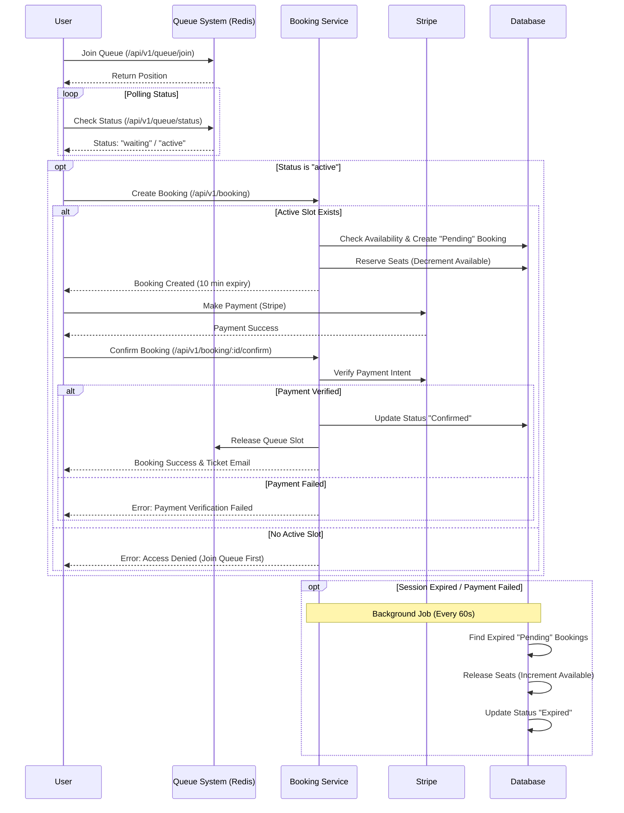

# Backend Documentation

## 1. High-Level Architecture
The backend is a Node.js/Express application following a layered architecture: **Routes -> Controllers -> Services -> Data Access (Prisma/Redis)**.

### Core Technologies
-   **Runtime**: Node.js
-   **Framework**: Express.js
-   **Database**: MongoDB (via Prisma ORM)
-   **Caching / Queue**: Redis (ioredis)
-   **Authentication**: JWT (Access + Refresh Tokens)
-   **Payment Processing**: Stripe
-   **Email**: Nodemailer

### Key Components
1.  **API Layer**: RESTful endpoints protected by `helmet`, `cors`, and custom rate limiters.
2.  **Service Layer**: Contains business logic for Auth, Booking, Queue management, etc.
3.  **Data Layer**:
    -   **Prisma Client**: Validates and persists data to MongoDB.
    -   **Redis Client**: Manages high-concurrency queueing and temporary booking slots.
4.  **Background Workers**:
    -   [cleanExpiredBookings](file:///d:/Projects/Event-Management-App/Event-Management-App/backend/services/bookingService.js#142-179): Periodic task (every 60s) to release seats from unpaid/expired bookings.
    -   [promoteUsers](file:///d:/Projects/Event-Management-App/Event-Management-App/backend/services/queueService.js#47-74): Periodic task (every 5s) to move users from the waitlist to active booking slots.

---

## 2. Database Schema (Prisma)
The application uses a MongoDB database with the following key models:

-   **User**: Stores authentication details (email, password hash, refresh token).
-   **Profile**: User profile information (name, phone, etc.).
-   **Concert**: Event details (name, date, venue, total seats).
-   **TicketCategory**: Pricing tiers for the concert (e.g., VIP, General).
-   **Booking**: Tracks ticket reservations.
    -   **Status**: `pending` (reserved), `confirmed` (paid), `expired`, `cancelled`.
-   **BookingQueue**: Persists user queue position and status (`waiting`, `active`, `completed`).
-   **Payment**: Records Stripe payment intents and statuses.

---

## 3. Core Workflows

### 3.1 Authentication
-   **Signup**: User registers with email -> System sends OTP via email (Redis TTL: 5 mins).
-   **Verification**: User submits OTP -> Account created -> Access/Refresh tokens issued.
-   **Login**: Email/Password login -> Access/Refresh tokens issued.
-   **Token Refresh**: Uses valid refresh token to get new access token.

### 3.2 Queue System (High Concurrency Handling)
To prevent overselling and server overload during high-demand sales:
1.  **Join Queue**: Users join a Redis list (`queue:concert:{id}`).
2.  **Promotion**: A background worker acts as a "turnstile", moving `MAX_ACTIVE_USERS` (e.g., 50) from the queue to an "active" set in Redis.
3.  **Active Slot**: Promoted users get a temporary time slot (e.g., 5 mins) to make a booking.
4.  **Enforcement**: Use of the booking API is restricted to users with an active slot in Redis.

### 3.3 Booking Flow
1.  **Selection**: User selects ticket category and quantity.
2.  **Reservation**:
    -   System checks if user has an active queue slot.
    -   Creates a `pending` Booking record.
    -   Decrements `availableSeats` in `TicketCategory` and `Concert`.
    -   Booking expires in 10 minutes if not confirmed.
3.  **Payment**: User pays via Stripe (Client-side creates intent, Server validates).
4.  **Confirmation**:
    -   Payment success triggers confirmation.
    -   Booking status updates to `confirmed`.
    -   Queue slot is released immediately for the next person.
    -   Confirmation email sent.

---

## 4. API Routes Reference

### Authentication (`/api/v1/auth`)
| Method | Endpoint | Description | Auth Required |
| :--- | :--- | :--- | :--- |
| `POST` | `/signup/email` | Register new user, sends OTP | No |
| `POST` | `/verify-otp` | Verify email OTP, returns tokens | No |
| `POST` | `/login/email` | Login with email/password | No |
| `POST` | `/refresh` | Refresh access token | No |
| `POST` | `/logout` | Invalidate refresh token | Yes |

### Concerts (`/api/v1/concert`)
| Method | Endpoint | Description | Auth Required |
| :--- | :--- | :--- | :--- |
| `GET` | `/` | Get concert details | No |

### Queue (`/api/v1/queue`)
| Method | Endpoint | Description | Auth Required |
| :--- | :--- | :--- | :--- |
| `POST` | `/join` | Join the waiting queue for tickets | Yes |
| `GET` | `/status` | Check current queue status/position | Yes |

### Booking (`/api/v1/booking`)
| Method | Endpoint | Description | Auth Required |
| :--- | :--- | :--- | :--- |
| `POST` | `/` | Create a pending booking (Requires active queue slot) | Yes |
| `GET` | `/pending` | Get user's current pending booking | Yes |
| `DELETE`| `/pending` | Cancel pending booking & release seats | Yes |
| `PATCH` | `/:id/confirm`| Confirm booking after payment | Yes |
| `GET` | `/confirmed/:bookingId` | Get details of a confirmed booking | Yes |
| `GET` | `/mine` | Get all confirmed bookings for user | Yes |

### Payments (`/api/v1/payment`)
| Method | Endpoint | Description | Auth Required |
| :--- | :--- | :--- | :--- |
| `GET` | `/pub-key` | Get Stripe public key | No |
| `POST` | `/create-intent` | Create Stripe PaymentIntent | Yes |
| `POST` | `/webhook/stripe`| Handle Stripe webhooks (e.g., payment_succeeded) | No |

---

## 5. Booking Flow Diagram

